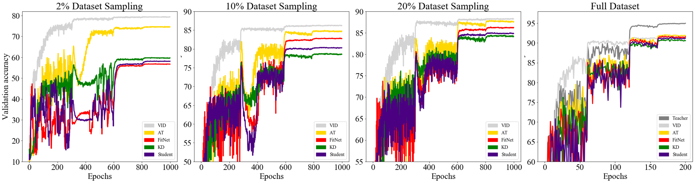

# Variational_Information_DIstillation

## Abstract
- Pros
- Cons

## Requirements
* python==3.x
* tensorflow>=1.13.0
* Scipy
## How to run

## Note that
- I found the author's code at https://github.com/ssahn0215/variational-information-distillation. However I'll not refer it, cause I want to check reproducibility of the paper.
- My experimental results are higher than the paper. I found that It is tough to make such a low performance like paper. For this, I removed gamma and regularization of batch normalization, and modify hyper-parameters to make training unstable.
- The authors said "We choose four pairs of intermediate layers similarly to [31], each of which is located at the end of a group of residual blocks." but there are only three groups of residual blocks in WResNet. So I sense one feature map after the first convolutional layer.

## Experiment results

   Methods  | Last Accuracy | Paper Accuracy | Last Accuracy |  Paper Accuracy 
:----------:| :-----------: | :-----------:  | :------------:|  :-------------: 
Student     |     91.22     |     90.72      | - | - 
Teacher     |     94.98     |     94.26      | - | - 
Soft-logits | - | 91.27| - | - 
FitNet      | - | 90.64| - | - 
AT          | - | 91.60| - | - 
VID         | - | 91.85| - | - 

   
  <b>Experimental results of full dataset</b>  

## TO DO
- Train student network using comparative methods.
- edit README
